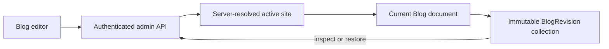

# CogCMS

A self-hostable, multi-site headless CMS built with Next.js 16, React 19, MongoDB/Mongoose, TypeScript and Vitest. Manage blogs, authors, FAQs, whitepapers and release notes in one editorial workspace, and deliver published content to your websites through a versioned API or restricted MongoDB views.

The CMS includes site-scoped users and API keys, editorial previews, stored blog rendering, signed publishing notifications, newsletter and FAQ intake, and optional S3 media uploads. Websites own their presentation. Start with the local demo below or [set up your own installation](docs/DEPLOYMENT.md).

## Local setup

Use Node 22 (`.nvmrc`), npm, **MongoDB 8.2.5** and MongoDB Shell (`mongosh`) for this local recipe. The CMS requires a replica set for transactional paths. Media upload is optional and disabled when the three `S3_*` values are unset.

Get the source and enter the project directory:

```sh
git clone https://github.com/mundra-aman/CogCMS.git
cd CogCMS
```

Then complete these steps from that directory:

1. Create an empty local data directory and start MongoDB with `mongod --replSet rs0 --bind_ip 127.0.0.1 --port 27017 --dbpath <empty-local-directory>`. In a second terminal, connect with `mongosh mongodb://localhost:27017` and run `rs.initiate({_id: 'rs0', members: [{_id: 0, host: 'localhost:27017'}]})` once. Do not point these commands at a shared database.
2. Run `npm ci`, copy `.env.example` to `.env`, and set a new local `CMS_JWT_SECRET` (at least 32 characters) and local `CMS_SEED_ADMIN_PASSWORD` (at least 12 characters). The example email is fictional. Keep `MONGODB_DB_NAME=cms_public_demo` and `MONGODB_URI=mongodb://localhost:27017/?replicaSet=rs0`.
3. Run `npm run seed:admin`, `npm run ensure:indexes`, then `npm run seed:demo`. The demo seed refuses remote MongoDB targets, any database name other than `cms_public_demo`, and an existing site or blog. It creates two fictional sites and 48 blogs; it never overwrites existing records.
4. Run `npm run dev` and open `http://localhost:3003/admin/login`. Sign in with the local admin, then choose **Northstar Studio** or **Harbor Notes** from the site selector. Explore the editors or create a site of your own. The demo has no public website, so its public View links are illustrative.

To reset, stop the app and verify that the target is your disposable local `cms_public_demo` database before dropping it with `mongosh`; then repeat the seed commands. No reset command is bundled so a copied command cannot silently erase another database.

## Checks

Run `npm run typecheck`, `npm test`, and `npm run build` sequentially. Unit and integration tests use a separate temporary MongoDB replica set. If its binary is not cached, `mongodb-memory-server` may download one. Report any setup or baseline failure separately from your changes.

## Boundaries

- Admin routes use a login session and active-site selection. `/api/v1` uses site-scoped keys and exposes published content only.
- Website rendering stays in the consumer; this repository owns editorial UI, content models and publication contracts. See [architecture](docs/ARCHITECTURE.md).
- Local editorial use needs no cloud account or paid service. Optional media and hosted installations use your own resources. See [deployment notes](docs/DEPLOYMENT.md).
- Keep credentials out of the repository. `.env.example` contains placeholders only.

Read [CONTRIBUTING.md](CONTRIBUTING.md) to contribute. The optional [assignment](ASSIGNMENT.md) provides a bounded example contribution; it does not define the scope of the product.

## Blog version history

CogCMS records an immutable, site-scoped revision whenever a blog is created, updated, or restored. Editors can open **Version history** from an existing blog editor, inspect a saved editorial snapshot, and restore it after confirmation. This protects against accidental edits without changing the public `/api/v1` contract.



The restore API always resolves the site from the authenticated session header/cookie flow; it never accepts a client `siteId`. Every blog and revision lookup filters by that site. A cross-site revision therefore behaves as absent, without disclosing IDs, counts, or metadata.

### How it works

1. Create or edit a blog normally. Each successful save stores a snapshot of its editorial fields in `blog_revisions` in the same MongoDB transaction as the blog write.
2. In an existing editor, select **Version history**, choose **Inspect**, then review the title, excerpt, tags, actor, time, and action.
3. Select **Restore this version** and confirm. For published blogs the dialog warns that live content may update.
4. CogCMS sanitizes the stored source HTML again and runs the current rendering pipeline. The live blog keeps its current slug, status, and `publishedAt`; its previous state remains recoverable because restore itself adds a `restored` revision referencing its source revision.

### Design decisions and trade-offs

- Revisions live in a separate collection rather than an embedded array, preventing an unbounded audit trail from growing the primary blog document. The `{ siteId, blogId, createdAt, _id }` index serves newest-first history reads.
- Documents are write-once: model fields are immutable and update operations are rejected. This makes a historical snapshot dependable.
- Snapshots contain editable source fields only, never site/audit IDs, timestamps, or generated HTML. Rendered HTML is deliberately regenerated on restore so current sanitizer and renderer protections apply.
- The URL slug and publication state are current-state properties. Preserving them avoids breaking public links or unexpectedly publishing/unpublishing an article from an old snapshot.
- Older blogs may predate this feature. Their first update writes a baseline `created` revision for the pre-update state, followed by the new `updated` revision atomically.
- MongoDB replica-set transactions atomically pair every mutation and revision write; if validation or either database write fails, neither is committed. Revision IDs plus timestamps provide ordering without introducing a fragile sequential counter under concurrent writes.

An embedded array would be simpler for small histories but creates document-size and query-growth pressure. The first release uses full snapshot inspection instead of visual diffs, preserves current publishing state rather than historical state, and covers blogs only. Future work could add side-by-side diffs, revision comments, retention policies, approvals, previews, export, and analogous histories for other content types.

No dependency was added for this feature: it uses Mongoose transactions/indexes, the existing sanitizer/rendering pipeline, existing `withAdmin` authorization, and the already-installed Radix Alert Dialog. A new dialog package was unnecessary because the existing dependency meets the confirmation and accessibility requirement.

### Verification and limitations

Run `npm run typecheck`, `npm test`, and `npm run build` after configuring the local replica set described above. For manual verification: create and edit a blog twice; inspect newest-first history; restore an older revision; verify that content changes while slug/status/`publishedAt` remain unchanged; switch active sites and confirm the history is absent; then test the loading/error retry, success message, keyboard close/confirmation, and a narrow viewport.

Revision lists intentionally omit the potentially large snapshot content; details fetch it only on demand. The UI currently offers snapshot inspection rather than a rich visual diff, and histories are retained indefinitely pending a future retention policy.

## Community and maintenance

- [Support](SUPPORT.md): questions, bug reports and feature requests.
- [Code of Conduct](CODE_OF_CONDUCT.md): participation and reporting concerns.
- [Security policy](SECURITY.md): private vulnerability reporting and maintenance scope.
- [Changelog](CHANGELOG.md): release status and notable changes.

This is the initial public-source preparation. There are no published stability or long-term support guarantees; review the deployment guide before running an installation with real data.

Licensed under the [MIT License](LICENSE), copyright 2026 Aman Mundra. See [source provenance](PROVENANCE.md) for the project's origins. This source distribution includes no private installation history or customer dataset.
